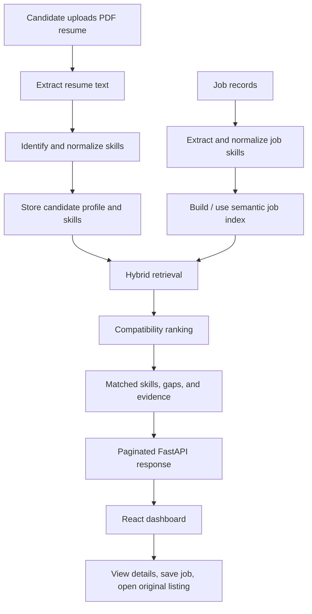

# ORBIT-JR 🪐

### Job discovery that starts with *your* skills

ORBIT-JR is a full-stack job and internship discovery platform built around a simple idea: a long list of openings is not very useful if you still have to figure out which ones fit your background.

Upload a PDF resume, add your preferences, and ORBIT-JR builds a skills-based profile. It then searches and ranks job opportunities, shows the skills that line up with each role, highlights gaps worth working on, and lets you save listings to revisit later.

<p align="center">
  <a href="https://orbit-jr-frontend.onrender.com"><strong>🚀 Open the demo</strong></a>
  &nbsp; · &nbsp;
  <a href="https://github.com/Keshav933/orbit-jr"><strong>💻 Browse the source</strong></a>
  &nbsp; · &nbsp;
  <a href="https://orbit-jr-backend.onrender.com/api/v1/health"><strong>🩺 API health check</strong></a>
</p>

<p align="center">
  
  
  
  
  
</p>

> **A note about the hosted demo:** ORBIT-JR currently uses free hosting resources. The first request after a period of inactivity, live job searches, and recommendation requests may take longer than expected. Please wait for an action to finish before clicking again. Running the project locally can reduce hosting-related delays, although local speed still depends on your computer, network, database, and model/index setup.

---

## Contents

- [The idea](#-the-idea)
- [What you can do](#-what-you-can-do)
- [How recommendations work](#-how-recommendations-work)
- [Architecture](#-architecture)
- [Technology stack](#-technology-stack)
- [Run it locally](#-run-it-locally)
- [Database and job data](#-database-and-job-data)
- [Environment variables](#-environment-variables)
- [API overview](#-api-overview)
- [Project structure](#-project-structure)
- [Checks and useful commands](#-checks-and-useful-commands)
- [Limitations and responsible use](#-limitations-and-responsible-use)
- [Troubleshooting](#-troubleshooting)
- [Roadmap](#-roadmap)
- [Contributing](#-contributing)

<details>
  <summary><strong>✨ Quick tour — what happens after you open ORBIT-JR?</strong></summary>

  1. **Create your profile:** enter a few details and upload a PDF resume.
  2. **Build a skill profile:** the backend extracts resume text and maps phrases to canonical skills and aliases.
  3. **Find relevant openings:** the retrieval pipeline considers explicit skill overlap and semantic similarity.
  4. **Understand each match:** inspect matched skills, skills to improve, and evidence taken from the job description.
  5. **Keep track:** open full job details, visit the original listing, or save a job for later.
  6. **Refresh opportunities:** request updated recommendations or search supported live job sources.

</details>

## 💡 The idea

Students often have a resume, a set of technical skills, and several job boards open at once. The hard part is comparing opportunities consistently: *Does this role fit my current skills? Which requirements do I already meet? What should I learn next?*

ORBIT-JR brings those questions into one place. It is designed as a **candidate-side decision aid**, with explanations intended to help people review an opportunity rather than blindly trust a ranking.

## 🎯 What you can do

| Feature | What it does |
| --- | --- |
| **Resume onboarding** | Accepts a PDF resume and profile details such as education, experience, location, preferred role, and summary. |
| **Resume text extraction** | Extracts readable text from the uploaded PDF for downstream processing. |
| **Skill identification** | Recognizes skill mentions and maps aliases to a canonical skill vocabulary, including ESCO-based skills and project-specific technical aliases. |
| **Personalized recommendations** | Combines skill-related retrieval with profile/job compatibility signals to rank suitable openings. |
| **Hybrid retrieval** | Uses lexical signals alongside semantic vector retrieval rather than relying only on exact keyword matches. |
| **Explainable matches** | Shows matched skills, required and preferred skill gaps, and supporting job-description evidence where available. |
| **Recommendation filters** | Supports filters for search text, location, role, remote work, minimum match score, experience, and employment type. |
| **Sorting and pagination** | Supports sorting options and backend pagination, returning one page of recommendations at a time. |
| **Job details** | Opens a detailed view with the available description, skills, work mode, and original listing link. |
| **Saved jobs** | Saves interesting opportunities to a dedicated saved-jobs view and allows removal. |
| **Fresh job search** | Can query supported live job sources and refresh recommendations when that integration is available. |
| **Service status** | Shows whether the frontend can reach the backend health endpoint. |

Feature availability and the number of jobs returned depend on the database contents, source availability, profile data, and deployment configuration.

## 🧭 How recommendations work

The recommendation process is a pipeline. Each stage adds information that helps the dashboard present a more useful result.



### The main stages

1. **Prepare the profile.** Resume text is extracted, then the skill extractor looks for recognized skills and aliases.
2. **Prepare job records.** Listings are stored in MySQL, and job skill mappings connect listings to canonical skills.
3. **Retrieve candidates.** Lexical skill overlap and semantic similarity provide complementary ways to find potentially relevant roles.
4. **Rank results.** The ranking layer considers several compatibility signals, including skill coverage and available role, experience, seniority, location, and market/recency information.
5. **Explain the result.** The dashboard can show skill matches, missing skills, and job-description evidence alongside match and confidence indicators.

The displayed match score and confidence are **heuristic recommendation signals**. They are not probabilities of being hired and should not be interpreted as a promise of interview or offer.

## 🏗️ Architecture

```text
┌────────────────────────────────────┐
│ React + Vite                       │
│ Onboarding · Filters · Job cards   │
│ Details · Saved jobs               │
└──────────────────┬─────────────────┘
                   │ HTTP / JSON
                   ▼
┌────────────────────────────────────┐
│ FastAPI                            │
│ Resume processing · REST endpoints │
│ Retrieval · Ranking · Explanations │
└───────────┬────────────────┬───────┘
            │                │
            ▼                ▼
┌──────────────────┐  ┌──────────────────┐
│ MySQL             │  │ FAISS index      │
│ Profiles · Jobs   │  │ Semantic vectors │
│ Skills · Saved    │  │ for job retrieval│
└──────────────────┘  └──────────────────┘
```

The frontend and backend are separate applications. During local development, Vite proxies `/api` requests to FastAPI. In production, the frontend uses `VITE_API_BASE_URL` to address the deployed backend, and the backend must allow the frontend origin through CORS.

### Technology stack

| Area | Technology | Purpose |
| --- | --- | --- |
| Frontend | React, Vite, JavaScript, CSS | Candidate dashboard and interactive job views |
| API | FastAPI, Uvicorn, Pydantic | REST endpoints, request validation, and backend application flow |
| Database | MySQL, `mysql-connector-python` | Users, profiles, resumes, jobs, skills, and saved-job records |
| Resume parsing | `pypdf` | Extract readable text from PDF resumes |
| Skill vocabulary | ESCO data plus project-specific aliases | Map different spellings and phrases to canonical skills |
| Semantic retrieval | FastEmbed with `all-MiniLM-L6-v2` embeddings | Represent job text as vectors for semantic retrieval |
| Vector search | FAISS | Search the generated job embedding index |
| Live job integrations | Jobicy, Himalayas, Remote OK; optional ATS integrations where configured | Discover additional current openings |
| Hosting | Render frontend/backend; Aiven MySQL in the configured deployment | Public demo and hosted database |

## 🚀 Run it locally

These instructions cover the application servers. A working local instance also needs a correctly configured MySQL database, job/skill data, and compatible generated indexes. See [Database and job data](#-database-and-job-data) before expecting recommendations from a fresh clone.

### Prerequisites

- Git
- Python **3.13** is the project's recommended reproducible version (`.python-version`)
- Node.js **22.12+** or a current supported Node.js release compatible with the installed Vite version
- npm
- Access to a MySQL database populated with the ORBIT-JR schema and data

### 1. Clone the repository

```bash
git clone https://github.com/Keshav933/orbit-jr.git
cd orbit-jr
```

### 2. Create and activate a Python environment

**Windows PowerShell**

```powershell
py -3.13 -m venv .venv
.\.venv\Scripts\Activate.ps1
python -m pip install --upgrade pip
```

If PowerShell cannot find `py -3.13`, install Python 3.13 first. If script activation is blocked by your system's execution policy, use the Python executable inside `.venv\Scripts` directly or follow your organization's PowerShell policy guidance.

**macOS / Linux**

```bash
python3.13 -m venv .venv
source .venv/bin/activate
python -m pip install --upgrade pip
```

### 3. Install backend dependencies

From the repository root, with the virtual environment active:

```bash
python -m pip install -r backend/requirements.txt
```

### 4. Configure the backend environment

Create `backend/.env` locally. Do **not** commit this file. Add the connection values for the MySQL database that contains your ORBIT-JR tables:

```dotenv
DB_HOST=your_mysql_host
DB_PORT=your_mysql_port
DB_USER=your_mysql_user
DB_PASSWORD=your_mysql_password
DB_NAME=your_database_name
```

Replace every placeholder with the actual values from your database provider. The database name must be the database where the ORBIT-JR tables are present; a provider's default database name is not necessarily the same as the project's database name. Follow the provider's required TLS/SSL settings.

### 5. Start FastAPI

From the **repository root**, open Terminal 1 and run:

```bash
uvicorn backend.app.main:app --reload
```

Expected local API address: `http://127.0.0.1:8000`.

Useful checks:

- Health endpoint: <http://127.0.0.1:8000/api/v1/health>
- Interactive API documentation: <http://127.0.0.1:8000/docs>
- Database connectivity check: <http://127.0.0.1:8000/api/v1/database-test>

The health endpoint checks that FastAPI is responding. The database-test endpoint separately checks whether the configured database connection works.

### 6. Install and start the frontend

Open Terminal 2:

```bash
cd frontend
npm install
npm run dev
```

Vite will print the local address, normally `http://localhost:5173`.

For local development, the existing Vite proxy forwards `/api` requests to `http://127.0.0.1:8000`. Leave `VITE_API_BASE_URL` unset locally unless you intentionally want to call another backend.

### 7. Build the frontend for production

From `frontend/`:

```bash
npm run build
```

The production files are written to `frontend/dist/`. To preview the built frontend locally, run `npm run preview` from the same directory.

## 🗄️ Database and job data

ORBIT-JR uses MySQL to keep profile, skill, and job information structured. A fresh clone is not, by itself, a populated recommendation database. You need the schema, imported records, and the matching index artifacts before the recommendation flow can return meaningful results.

The database design includes tables for:

| Table | Role in the application |
| --- | --- |
| `users` | Basic user/account information |
| `profiles` | Candidate education, preferences, location, and experience |
| `resumes` | Uploaded resume metadata and extracted text |
| `skills` | Canonical skill vocabulary |
| `skill_aliases` | Alternative names and phrases for canonical skills |
| `profile_skills` | Skills associated with a candidate profile |
| `jobs` | Structured job listings and source metadata |
| `job_skills` | Skill mappings associated with job listings |
| `recommendations` | Recommendation records, where persisted |
| `evidence` | Explanation/evidence records, where persisted |
| `saved_jobs` | Jobs a candidate has saved |
| `skill_market_stats` | Corpus-derived skill frequency and recency signals |
| `feedback` | Feedback records |

### Data and preparation scripts

The repository's `scripts/` directory includes pipeline tools for inspecting and preparing data. The following scripts are useful when their expected source files and database schema are available:

| Script | Purpose |
| --- | --- |
| `scripts/check_role_radar.py` | Inspect job dataset structure and record consistency |
| `scripts/prepare_role_radar.py` | Prepare and validate the Role Radar data |
| `scripts/finalize_jobs.py` | Produce a deduplicated job dataset |
| `scripts/import_jobs.py` | Import job records into MySQL |
| `scripts/check_esco.py` | Inspect ESCO skill data |
| `scripts/import_esco_skills.py` | Import ESCO skills and aliases |
| `scripts/import_technical_skills.py` | Import project-specific technical vocabulary, when provided |
| `scripts/extract_job_skills.py` | Extract and associate skills with job records |
| `scripts/build_job_index.py` | Build the main job vector index |
| `scripts/build_live_job_index.py` | Build the live-job vector index |

Run data preparation only after reviewing each script's inputs and target database. Do not run import scripts against a database containing important data until you understand what the script inserts or updates. Source files and generated indexes may not all be present in every clone or branch.

### Dataset notes

The initial development corpus was based on the [Role Radar dataset on Hugging Face](https://huggingface.co/datasets/oksomu/role-radar-dataset). The recorded preparation run started with 2,500 raw job records and produced 2,471 unique job IDs after deduplication. This describes that preparation run, not a guarantee about the number of current or live openings.

ESCO provides a broad skills taxonomy. Project-specific aliases help cover additional software-engineering terminology that may not map cleanly to a single ESCO label. Both taxonomies and extracted text can have coverage gaps or false positives, so extracted skills should be reviewed when accuracy matters.

## 🔐 Environment variables

### Backend

Create these values in `backend/.env` for local development, or enter them in your deployment provider's environment settings for production:

| Variable | Required | Description |
| --- | --- | --- |
| `DB_HOST` | Yes | MySQL hostname from the database provider |
| `DB_PORT` | Yes | MySQL port from the database provider |
| `DB_USER` | Yes | Database username |
| `DB_PASSWORD` | Yes | Database password; keep it private |
| `DB_NAME` | Yes | Database containing the ORBIT-JR tables |
| `CORS_ORIGINS` | For cross-origin browser requests | Comma-separated allowed frontend origins, for example `http://localhost:5173,https://your-frontend.onrender.com` |

The CORS origin is the frontend website origin only: do not append `/api/v1` to it.

### Frontend

| Variable | Description |
| --- | --- |
| `VITE_API_BASE_URL` | Backend origin used by the production frontend, such as `https://your-backend.onrender.com`. Do not append `/api/v1`; the frontend service adds that path. |

Vite embeds `VITE_*` values into the frontend at build time. After changing a production value, rebuild and redeploy the static site.

### Security checklist

- Never commit `backend/.env`, passwords, database URIs containing credentials, or API tokens.
- Keep `backend/local.env` and other private configuration files out of Git.
- Use environment variables in the deployment dashboard for production secrets.
- Treat uploaded resumes as personal information. Only upload a resume to a deployment you trust.
- Do not expose database credentials in frontend variables. Anything included in the frontend build can be read by visitors.

## 🔌 API overview

The API prefix is `/api/v1`. FastAPI's interactive schema is available at `/docs` while the backend is running.

| Method | Endpoint | Purpose |
| --- | --- | --- |
| `GET` | `/` | Basic API-running message |
| `GET` | `/api/v1/health` | Backend health check |
| `GET` | `/api/v1/database-test` | Test the configured MySQL connection |
| `POST` | `/api/v1/users` | Create a user |
| `GET` | `/api/v1/users` | List users |
| `GET` | `/api/v1/users/{user_id}` | Fetch one user |
| `PUT` | `/api/v1/users/{user_id}` | Update user information |
| `DELETE` | `/api/v1/users/{user_id}` | Delete a user |
| `POST` | `/api/v1/resumes/upload/{user_id}` | Upload a PDF resume for a user |
| `POST` | `/api/v1/resumes/{resume_id}/extract-skills` | Extract skills from a stored resume |
| `POST` | `/api/v1/candidates/onboard` | Create/update a candidate from profile fields and a PDF resume |
| `GET` | `/api/v1/recommendations/{profile_id}` | Retrieve filtered, sorted, paginated recommendations |
| `GET` | `/api/v1/jobs/{job_id}` | Fetch job details |
| `GET` | `/api/v1/saved-jobs/{profile_id}` | List saved jobs |
| `GET` | `/api/v1/saved-jobs/{profile_id}/ids` | Get saved job IDs |
| `POST` | `/api/v1/saved-jobs/{profile_id}/{job_id}` | Save a job |
| `DELETE` | `/api/v1/saved-jobs/{profile_id}/{job_id}` | Remove a saved job |

<details>
  <summary><strong>📄 Recommendation endpoint parameters and example</strong></summary>

  `GET /api/v1/recommendations/{profile_id}` supports these query parameters:

  | Parameter | Meaning |
  | --- | --- |
  | `top_k` | Requested candidate pool size for the recommendation service |
  | `page` | Page number, starting at `1` |
  | `page_size` | Number of results per page; the route currently caps this at `20` |
  | `search` | Search job titles/descriptions according to the current filters |
  | `location` | Location filter |
  | `role` | Role/category filter |
  | `remote_only` | Restrict to remote jobs when `true` |
  | `min_score` | Minimum match score between `0` and `1` |
  | `experience_level` | Experience-level filter |
  | `employment_type` | Employment-type filter |
  | `sort_by` | Sorting option, including `recent`, `best_match`, and `skill_match` |

  Example request:

  ```http
  GET /api/v1/recommendations/3?top_k=20&page=1&page_size=20&sort_by=recent
  ```

  The response includes the profile ID, total count, current page, page size, page count, `has_more`, active filters, and the current page's `recommendations` array.

</details>

<details>
  <summary><strong>🧪 Example health check using PowerShell</strong></summary>

  ```powershell
  Invoke-WebRequest "http://127.0.0.1:8000/api/v1/health" -UseBasicParsing
  ```

  The response should have HTTP status `200` and a JSON body similar to:

  ```json
  { "status": "ok" }
  ```

</details>

## 📁 Project structure

The outline below shows the main application areas. Some data, index, cache, and helper files are omitted for readability.

```text
orbit-jr/
├── backend/
│   ├── app/
│   │   ├── main.py                 # FastAPI app and HTTP routes
│   │   ├── database.py             # MySQL connection setup
│   │   ├── schemas.py              # Request/response schemas
│   │   ├── resume_parser.py        # PDF text extraction
│   │   ├── skill_extractor.py      # Skill and alias matching
│   │   ├── onboarding.py           # Candidate onboarding workflow
│   │   ├── live_job_research.py    # Live job search API router
│   │   ├── live_job_sync.py        # Live job synchronization
│   │   ├── retrieval.py            # Lexical retrieval
│   │   ├── hybrid_retrieval.py     # Combined retrieval
│   │   ├── ranking.py              # Compatibility ranking
│   │   ├── evidence.py             # Skill gaps and evidence
│   │   ├── confidence.py           # Recommendation confidence signal
│   │   ├── recommendations.py      # Recommendation orchestration
│   │   ├── job_details.py          # Job detail retrieval
│   │   └── saved_jobs.py           # Saved-job operations
│   └── requirements.txt
├── frontend/
│   ├── src/
│   │   ├── App.jsx                 # Main React application
│   │   ├── styles.css              # Main styles
│   │   ├── jobUxOverrides.css      # Job UI refinements
│   │   ├── liveSearchStyles.css    # Live-search UI styles
│   │   └── services/
│   │       ├── api.js              # Main API client
│   │       └── liveJobApi.js       # Live job API client
│   ├── package.json
│   └── vite.config.js              # Local /api proxy
├── data/
│   ├── raw/role-radar/             # Raw job/profile data, when present
│   └── indexes/                    # Generated retrieval indexes, when present
├── scripts/                        # Import, preparation, indexing, and test tools
├── .python-version
├── .gitignore
└── README.md
```

## ✅ Checks and useful commands

Run these from the repository root unless stated otherwise.

| Goal | Command |
| --- | --- |
| Verify FastAPI imports | `python -c "from backend.app.main import app; print('FastAPI import successful')"` |
| Start backend | `uvicorn backend.app.main:app --reload` |
| Install frontend packages | `cd frontend && npm install` |
| Start frontend | `cd frontend && npm run dev` |
| Build frontend | `cd frontend && npm run build` |
| Run skill extractor checks, if dataset/configuration is ready | `python scripts/test_skill_extractor.py` |
| Test retrieval, if database and indexes are ready | `python scripts/test_hybrid_retrieval.py` |
| Rebuild main index, if MySQL job records are ready | `python scripts/build_job_index.py` |
| Rebuild live-job index, if its source data is ready | `python scripts/build_live_job_index.py` |

The data and retrieval test scripts rely on the required local data, database connection, and/or indexes. A failure in those checks may indicate missing setup rather than a frontend build problem.

## 🧯 Troubleshooting

<details>
  <summary><strong>Frontend opens, but API requests fail</strong></summary>

  - Confirm FastAPI is running at `http://127.0.0.1:8000`.
  - Open `/api/v1/health` directly.
  - For production, verify `VITE_API_BASE_URL` on the frontend service and `CORS_ORIGINS` on the backend service.
  - Rebuild/redeploy the frontend after changing `VITE_API_BASE_URL`.

</details>

<details>
  <summary><strong>MySQL says “Unknown MySQL server host”</strong></summary>

  1. Copy the hostname from the database provider's current connection information.
  2. Check the port and whether the database service is running.
  3. Test DNS with `nslookup YOUR_DB_HOST` and port reachability with `Test-NetConnection YOUR_DB_HOST -Port YOUR_DB_PORT` in PowerShell.
  4. If DNS returns `Non-existent domain`, verify the hostname and public connection route with the provider before changing Python code or credentials.

</details>

<details>
  <summary><strong>MySQL connects, but the database or tables are missing</strong></summary>

  - `DB_NAME` must name the database that actually contains the ORBIT-JR tables.
  - Check that the schema and job/skill imports have been completed.
  - Confirm the MySQL account has permission to read and update the tables needed by the endpoint.

</details>

<details>
  <summary><strong>Recommendations are empty</strong></summary>

  - Confirm the requested profile exists and has usable profile data.
  - Check that `jobs`, `skills`, and `job_skills` contain records.
  - Confirm the configured FAISS index was generated from the current job corpus.
  - Temporarily clear restrictive filters and try again.

</details>

<details>
  <summary><strong>The hosted demo is slow</strong></summary>

  Free hosting has limited CPU and memory and may pause services when idle. Cold starts and ranking/index work may take time. Wait for the current request to finish before clicking again. Local execution avoids some hosted-service delays but still needs a working database and generated indexes.

</details>

## ⚖️ Limitations and responsible use

- **A match is guidance, not a hiring prediction.** ORBIT-JR does not predict whether a company will interview or hire someone.
- **Skill extraction is imperfect.** Resume formatting, unusual terminology, aliases, and ambiguous words can lead to missed or incorrect matches.
- **Job data changes.** External job sources can be unavailable, change their response formats, or contain listings that have expired. Always open the original listing and confirm its current details before applying.
- **Coverage depends on configuration.** Results depend on imported records, the live-source integrations enabled in the deployment, and the generated search indexes.
- **Resume privacy matters.** Treat resumes as personal data and only use deployments whose data-handling practices you understand.
- **Hosted latency varies.** Performance depends on available compute, source response times, database access, and index/model initialization.

## 🛣️ Roadmap

This is a student-built project that is being improved incrementally. Areas worth continuing to work on include:

- [ ] Review skill-extraction accuracy against a wider set of real-world resumes and job descriptions.
- [ ] Improve the first-run setup so a new developer can initialize the database and indexes more easily.
- [ ] Finish the profile-management experience and reduce manual setup steps.
- [ ] Expand testing across recommendations, saved jobs, live search, and empty/error states.
- [ ] Improve the documentation of data refresh and source-specific limitations.
- [ ] Continue responsive and accessibility checks for the candidate dashboard.

## 🤝 Contributing

Suggestions, bug reports, and improvements are welcome.

1. Fork the repository.
2. Create a focused branch for your change.
3. Keep credentials, uploaded resumes, and private data out of commits.
4. Test the affected flow and run `npm run build` for frontend changes.
5. Open a pull request describing the problem, the change, and how you tested it.

For bug reports, include the endpoint or screen involved, the steps to reproduce the issue, and the relevant error message. Remove passwords, tokens, email addresses, and resume contents before sharing logs.

## 🙌 Acknowledgements

- [ESCO](https://esco.ec.europa.eu/) for the skills taxonomy.
- [Role Radar dataset](https://huggingface.co/datasets/oksomu/role-radar-dataset) for the initial job corpus used during development.
- [FastAPI](https://fastapi.tiangolo.com/), [React](https://react.dev/), [Vite](https://vite.dev/), [FastEmbed](https://qdrant.github.io/fastembed/), and [FAISS](https://github.com/facebookresearch/faiss) for the project technologies.
- The job-source providers configured by the project, including [Jobicy](https://jobicy.com/), [Himalayas](https://himalayas.app/), and [Remote OK](https://remoteok.com/).

---

<p align="center">
  <strong>Built to make the job search a little more understandable.</strong><br>
  <a href="https://github.com/Keshav933/orbit-jr">ORBIT-JR on GitHub</a>
</p>
